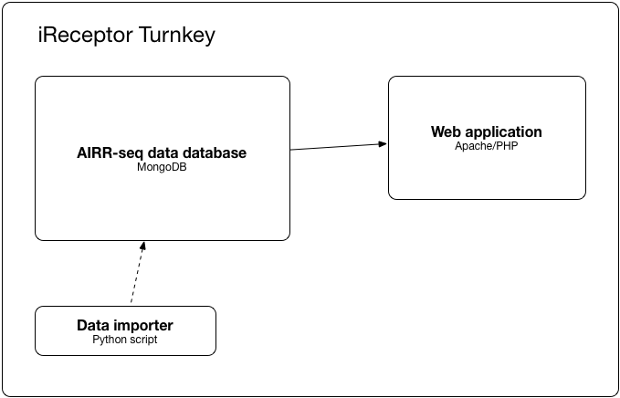

# iReceptor Turnkey

The iReceptor Turnkey is a quick and easy mechanism for a researcher or research group to install and manage an [AIRR-seq data](https://www.nature.com/articles/ni.3873) repository. In addition, the included iReceptor Web Service makes it possible to integrate the repository into the [AIRR Data Commons](https://docs.airr-community.org/en/latest/api/adc.html#datacommons). 

For more information, refer to the [iReceptor Turnkey](http://www.ireceptor.org/repositories#turnkey) section on the main [iReceptor web site](http://www.ireceptor.org/).

The remainder of this document provides directions on how to install and run the iReceptor Turnkey.

## What is it?
- a database
- a web application exposing that database through the [AIRR Data Commons (ADC) API](https://docs.airr-community.org/en/latest/api/adc_api.html)
- some scripts to load your data into the database



## How does it work?
Docker containers are used to make the installation and future updates clean and simple. For more information, see [How it works](doc/how_it_works.md).

## Installation
Download the code (from the `production` branch) and excute the install script. It will take 10-30 min, depending on the download speed of the Docker images.
```
# download the code
git clone --branch production-v2 https://github.com/sfu-ireceptor/turnkey-service-php.git

# launch the installation (multiple Docker images will be downloaded from DockerHub)
cd turnkey-service-php
scripts/install_turnkey.sh
```

## Check it's working

Go to <http://localhost/airr/v1/info> in your browser (if necessary, replace "localhost" with your server URL).

This returns the list of samples in your database by querying the web application at `/airr/v1/info`, which is an entry point of the [AIRR Data Commons (ADC) API](https://docs.airr-community.org/en/latest/api/adc_api.html). An short information response should be returned.

You can also use the command line:
```
curl "http://localhost/airr/v1/info"
```

## Loading data

#### General procedure
1. load the metadata associated with a study that has generated sequence data.
2. load the sequence annotations (from imgt, mixcr, etc).

#### Quick example: loading the test data
The example data in this directory is a small subset of the data from the paper "The Different T-cell Receptor Repertoires in Breast Cancer Tumors, Draining Lymph Nodes, and Adjacent Tissues" by Wang et. al. (https://www.ncbi.nlm.nih.gov/pubmed/28039161). The test data set consists of the first 1000 rearrangments from a single repertoire from this study. 

1. Load the iReceptor metadata file [test_data/PRJNA330606_Wang_One_Sample.csv](test_data/PRJNA330606_Wang_One_Sample.csv).
This file contains the reperotire metadata from a single repertoire from this study. 
```
scripts/load_metadata.sh ireceptor test_data/PRJNA330606_Wang_One_Sample.csv
```

To check it worked execute:
```
curl --data "{}" "http://localhost/airr/v1/repertoire"
```
This should result in a JSON response that lists the metadata from the study.

2. Load the associated sequence annotations file [test_data/SRR4084215_aa_mixcr_annotation_1000_lines.txt.gz](test_data/SRR4084215_aa_mixcr_annotation_1000_lines.txt.gz):
```
scripts/load_rearrangements.sh mixcr test_data/SRR4084215_aa_mixcr_annotation_1000_lines.txt.gz
```

To check it worked execute the following command:
```
curl --data "{}" "http://localhost/airr/v1/rearrangement"
```
This should result in a JSON repsonse with all of the sequence rearrangement data for the 1000 sequences in the data file.

Note: to load IMGT or AIRR annotations, replace the `mixcr` parameter by `imgt` or `airr`. Example:
```
scripts/load_rearrangements.sh imgt <IMGT file>
```

Congratulations :relaxed: You can now [reset the turnkey database](doc/resetting.md) and load your own data.

## Loading large data sets

The above scripts can be used to load large data sets. In particular, the load_rearrangements.sh script can be used to load many rearrangement files in a row. We recommend following a well structured data curation process to help ensure data provenance around your data management. Please refer to the [iReceptor Curation](http://www.ireceptor.org/curation) process and the [iReceptor Curation GitHub repository](https://github.com/sfu-ireceptor/dataloading-curation/tree/master) for more information on recommended data curation approaches.

Assuming all data for a study can be found in a single directory, it is possible to utilize the two commands described above to load the entire study data. Assuming your data is in a folder called STUDY_DATA, the study metadata is stored in a metadata file called METADATA.csv, and all of your rearrangement files are MiXCR .txt files, you can do the following:

1. To load your Repertiore Metadata use the load_metadata.sh scrip as above:

```
scripts/load_metadata.sh ireceptor STUDY_FOLDER/METADATA.csv
```

2. To load your rearrangement data, use the load_rearrangements.sh as given below:

```
scripts/load_rearrangements.sh mixcr STUDY_FOLDER/*.txt
```
It is important to note that depending on the size of the data in your rearrangement files, loading the rearrangements can take a very long time. As a result, it is good practice to use the Unix "nohup" command to control the rearrantement loading. The Unix nohup command allows you to run a long running command in the background, redirects the output of that command to a file, and allows you to log out and come back to check on the progress of your command later. You would use the nohup command as follows:
```
nohup scripts/load_rearrangements.sh mixcr STUDY_FOLDER/*.txt > rearrangement.log &
```
Also note that both the load_metadata.sh and the load_rearrangement.sh command produce log files for every file that they process. If you want to view the log files simply refere to the files in the log directory. Log files are named using date and the file that was processed.

## Maintenance
When your data is loaded, make sure to [back up the database](doc/database_backup.md) to avoid going through the loading process again if a problem happens.  

## More information
- [How it works](doc/how_it_works.md)
- [Troubleshooting](doc/troubleshooting.md) :hammer:
- [Backing up and restoring the database](doc/database_backup.md)
- [Moving the database to another folder](doc/moving_the_database_folder.md)
- [Updating the turnkey](doc/updating.md)
- [Resetting the turnkey database](doc/resetting.md)
- [Web statistics](doc/web_stats.md)

## Contact us
:envelope: <support@ireceptor.org>
